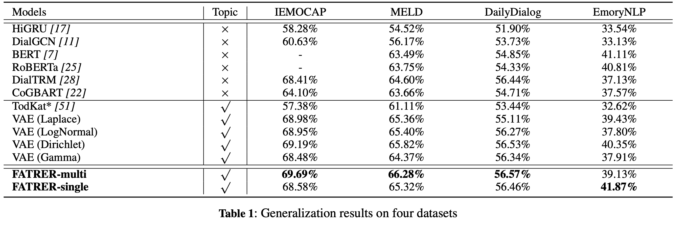

[](https://badges.toozhao.com/stats/01H6DP5J9EN57TWX753KQ0MR83 "Get your own page views count badge on badges.toozhao.com")  
# FATRER
[ECAI 2023] Official Pytorch implementation of "FATRER: Full-Attention Topic Regularizer for Accurate and Robust Conversational Emotion Recognition" [[paper]](https://ebooks.iospress.nl/volumearticle/64385) 
## Framework
Full-attention topic regularizer(FATRER) introduces an emotion-related
global view when modeling the local context in a conversation. A
joint topic modeling strategy is introduced to implement regularization from both representation and loss perspectives. To avoid overregularization, FATRER drops the constraints on prior distributions that exist in traditional topic modeling and perform probabilistic approximations based entirely on attention alignment. Experiments show
that FATRER obtain more favorable results than state-of-the-art
models, and gain convincing robustness.

## News
- [**2023-10-02**]: FARTER will be presented orally([Video](https://www.youtube.com/watch?v=421nOe7BO-Q)) in ECAI2023([Programme](https://ecai2023.eu/programm)) Technical Session 1 at 09:30 AM in Room S4A and Poster Session 1 at 11:15 AM in Hall S3B([Poster](https://drive.google.com/file/d/1GSbm6Po223JmfjxDnQJ6O428-p83grze/view?usp=drive_link)).
- [**2023-07-15**]: FARTER has been accepted by [ECAI 2023](https://ecai2023.eu/acceptedpapers) (Paper 223).

## Prerequisites
- Python 3.9.12
- Pytorch 1.10.1+cu113
``` ruby
  pip instll -r requirements.txt
```
## Usage
### Benchmark Datasets
- IEMOCAP/MELD/EmoryNLP/EmoryNLP
###  Generalization results on four datasets

###  Execution
#### IEMOCAP
1. FARTER-Multi: 
``` ruby
    # train
    python main.py conf/FATRER_multi.yaml

    #train and conduct attack(U+C) based on PWWS(per 50 epoch):
    python main.py conf/FATRER_multi_pwws_attack.yaml

    #train and conduct attack(U+C) based on TextFooler(per 50 epoch):
    python main.py conf/FATRER_multi_textfooler_attack.yaml

    #train and conduct attack(U+C) based on TextBugger(per 50 epoch):
    python main.py conf/FATRER_multi_textbugger_attack.yaml
```
2. FARTER-Multi(without topic-oriented regularization):
``` ruby
    # train
    python main.py conf/FATRER_multi_wo_topic.yaml
```
3. FARTER-Single: 
``` ruby
    # train
    python main.py conf/FATRER_single.yaml
``` 
4. FARTER-Single(without topic-oriented regularization): 
``` ruby
    #train
    python main.py conf/FATRER_single_wo_topic.yaml
``` 
5. DialTRM(Baseline): 
``` ruby
    #train
    python main.py conf/Baseline.yaml
``` 
6. VAE(topic-oriented)
``` ruby
  #train VAE(Laplace)
  python main.py conf/VAE_Laplace.yaml

  #train VAE(Dirichlet)
  python main.py conf/VAE_Dirichlet.yaml

  #train VAE(Gamma)
  python main.py conf/VAE_Gamma.yaml

  #train VAE(LogNormal)
  python main.py conf/VAE_LogNormal.yaml
``` 
#### MELD
1. FARTER-Multi: 
``` ruby
    python main.py conf/FATRER_multi_MELD.yaml
``` 
2. FARTER-Single: 
``` ruby
    python main.py conf/FATRER_single_MELD.yaml
``` 
#### EmoryNLP
1. FARTER-Multi: 
``` ruby
    python main.py conf/FATRER_multi_EmoryNLP.yaml
```
2. FARTER-Single: 
``` ruby
    python main.py conf/FATRER_single_EmoryNLP.yaml
```

#### DailyDialog
1. FARTER-Multi: 
``` ruby
    python main.py conf/FATRER_multi_DailyDialog.yaml
```
2. FARTER-Single: 
``` ruby
    python main.py conf/FATRER_single_DailyDialog.yaml
```
## Cite us
Please cite the following paper if you find this code useful in your work.
```
@article{mao2023fatrer,
  title={FATRER: Full-Attention Topic Regularizer for Accurate and Robust Conversational Emotion Recognition},
  author={Mao, Yuzhao and Lu, Di and Wang, Xiaojie and Zhang, Yang},
  journal={arXiv preprint arXiv:2307.12221},
  year={2023}
}
```

## License
MIT license
