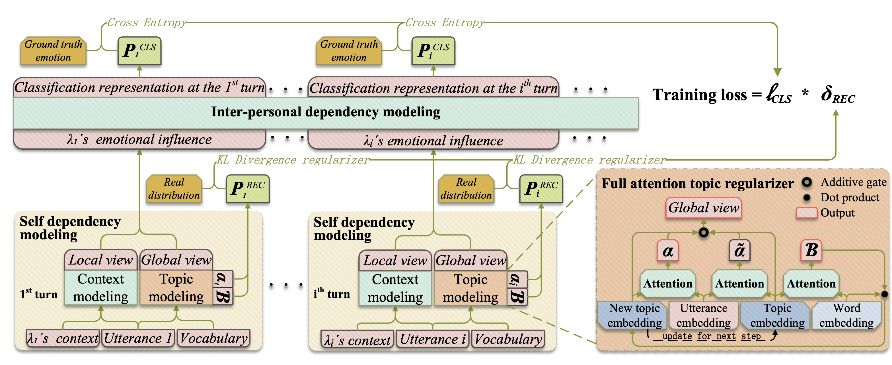

# FATRER
FATRER: Full-Attention Topic Regularizer for Accurate and Robust Conversational Emotion Recognition
## Framework

## Environment
- prepare environment:
  -  pip instll -r requirements.txt

## Benchmark Datasets
###  Generalization results on four datasets

### IEMOCAP
- FARTER-Multi: 
  - train: 
      - python main.py conf/FATRER_multi.yaml
  - train and conduct attack based on PWWS(per 50 epoch):
      - python main.py conf/FATRER_multi_pwws_attack.yaml
  - train and conduct attack based on TextFooler(per 50 epoch):
      - python main.py conf/FATRER_multi_textfooler_attack.yaml
  - train and conduct attack based on TextBugger(per 50 epoch):
      - python main.py conf/FATRER_multi_textbugger_attack.yaml

- FARTER-Multi(without topic-oriented regularization):
  - train:
      - python main.py conf/FATRER_multi_wo_topic.yaml

- FARTER-Single: 
  - train: 
      - python main.py conf/FATRER_single.yaml
  
- FARTER-Single(without topic-oriented regularization): 
  - train: 
      - python main.py conf/FATRER_single_wo_topic.yaml

- Baseline(DialTRM): 
  - train:
      - python main.py conf/Baseline.yaml

- VAE(Laplace):
  - train:
      - python main.py conf/VAE_Laplace.yaml
- VAE(Dirichlet):
  - train:
      - python main.py conf/VAE_Dirichlet.yaml 
- VAE(Gamma):
  - train:
      - python main.py conf/VAE_Gamma.yaml
- VAE(LogNormal):
  - train:
      - python main.py conf/VAE_LogNormal.yaml

### MELD
- FARTER-Multi: 
  - train: 
      - python main.py conf/FATRER_multi_MELD.yaml
- FARTER-Single: 
  - train: 
      - python main.py conf/FATRER_single_MELD.yaml

### EmoryNLP
- FARTER-Multi: 
  - train: 
      - python main.py conf/FATRER_multi_EmoryNLP.yaml
- FARTER-Single: 
  - train: 
      - python main.py conf/FATRER_single_EmoryNLP.yaml

### DailyDialog
- FARTER-Multi: 
  - train: 
      - python main.py conf/FATRER_multi_DailyDialog.yaml
- FARTER-Single: 
  - train: 
      - python main.py conf/FATRER_single_DailyDialog.yaml
 

